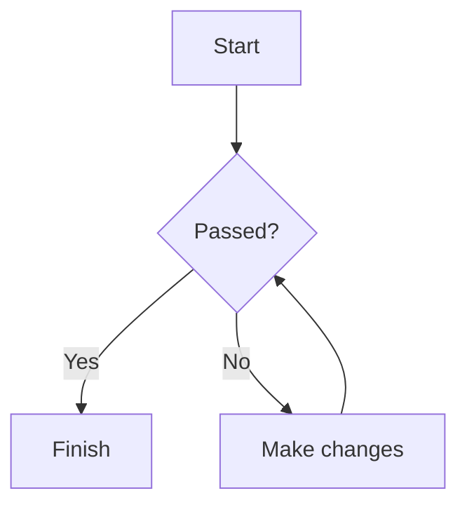

# Website

This website is built using [Docusaurus](https://docusaurus.io/), a modern static website generator.

## Installation

```bash
npm install
```

**Note**: feel free to use the package manager of your choice.

## Local Development

```bash
npm run start
```

This command starts a local development server and opens up a browser window. Most changes are reflected live without having to restart the server.

## Project Content

- `docs/intro.mdx` is the main introduction and is kept in the project.
- `docs/theory/` contains the project's theory documents.
- `src/components/SortableTable/` contains the reusable sortable table component for MDX.
- The starter documentation tutorials are archived outside the project at `D:\IdeaProjects\AnimaDocs-template-archive\docs`.
- The sample blog and standalone Markdown page remain available; only the starter documentation tutorial folders were moved out of the project.

## Mermaid Diagrams

This project has Mermaid support enabled through `@docusaurus/theme-mermaid`. The dependency is already listed in `package.json`; run the following command after cloning the project to install it:

```bash
npm install
```

When enabling Mermaid in another Docusaurus project, install the theme explicitly:

```bash
npm install @docusaurus/theme-mermaid@3.10.2
```

The theme installs Mermaid itself. The optional `@mermaid-js/layout-elk` package is only needed for Mermaid layouts that use ELK; standard flowcharts do not require it.

Write a Mermaid code block in any document under `docs`:

````md

````

The code block is rendered as a diagram in the generated page. Mermaid also supports sequence diagrams, state diagrams, class diagrams, entity-relationship diagrams, Gantt charts, and mind maps.

The Mermaid configuration is in `docusaurus.config.ts`:

```ts
markdown: {
  mermaid: true,
},

themes: ['@docusaurus/theme-mermaid'],
```

After changing dependencies or this configuration, restart the development server. Changes to diagram content are hot-reloaded while running `npm run start`.

## Sortable Tables in MDX

The reusable table component is located at `src/components/SortableTable`. Keep the sorting logic in the component and define only the columns and rows in an MDX file:

```mdx
import SortableTable from '@site/src/components/SortableTable';

export const columns = [
  {key: 'name', label: '名称', sortable: false},
  {key: 'power', label: '攻击力'},
  {key: 'speed', label: '速度'},
  {key: 'defense', label: '防御力'},
];

export const data = [
  {id: 'a', name: '项目 A', power: 80, speed: 60, defense: 90},
  {id: 'b', name: '项目 B', power: 95, speed: 70, defense: 65},
  {id: 'c', name: '项目 C', power: 72, speed: 88, defense: 78},
];

<SortableTable
  columns={columns}
  data={data}
  rowKey="id"
  defaultSort={{key: 'power', direction: 'desc'}}
/>
```

Sortable columns start in descending order. Clicking the same column toggles ascending/descending; clicking another column switches the active sort column. Set `sortable: false` for a column that should only display values. The optional `render` and `sortValue` callbacks can customize cell display and sorting without moving the core algorithm into the MDX file.

## Build

```bash
npm run build
```

This command generates static content into the `build` directory and can be served using any static contents hosting service.

## Deployment

Using SSH:

```bash
USE_SSH=true npm run deploy
```

Not using SSH:

```bash
GIT_USER=<Your GitHub username> npm run deploy
```

If you are using GitHub Pages for hosting, this command is a convenient way to build the website and push to the `gh-pages` branch.
