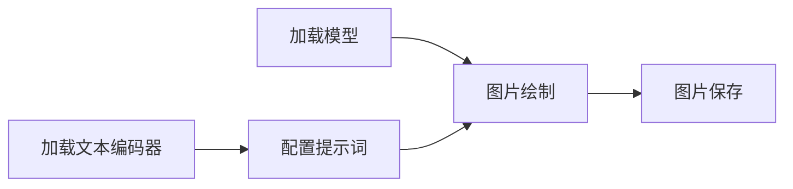

import SortableTable from '/src/components/SortableTable';

# 序：什么是ComfyUI与Anima

相信能找到这里的人应该都至少知道什么是ai跑图，能干什么了，就不再赘述了。

本教程主要着重于介绍如何使用`ComfyUI`跑图，以`anima`为主模型进行演示。
除非另行强调，和`ComfyUI`有关的所有部分都是通用的，如果您使用的是其它模型，也可以遵循同样的基本逻辑使用。

不过，在开始之前，请容我介绍一下什么是`ComfyUI`和`anima`

## 什么是ComfyUI

`ComfyUI`（下文中简写为CUI）是一款为AI跑图打造的工具，采用节点式工作流实现流程化图片生成。
其**本身并不能直接生成图像**，但允许用户根据自身需求灵活且便捷地使用各种不同的跑图模型，并通过调整参数或应用自定义节点来实现更好的出图效果。

你可能听过类似`sd/WebUI`之类的说法，这是另一种工具 *(注:sd有时候指的是sd系模型，这是另一码事，请根据语境自行判断)*。

在底层逻辑上，二者几乎相同。差异来自用户可控性方面：`ComfyUI`数据调度流程交给用户，而`WebUI`则将流程包装，只将常用的需要调整的数据交给用户设置。
由于这种用户层面设计的，`ComfyUI`拥有**更灵活的操作方式，对新模型有更好的支持，但上手难度相对较高**。

从界面样式上就可以分辨使用的是哪种工具：`WebUI`更像是一个所有数据都放在一起调整的设置界面，而`ComfyUI`更像是一个流程图：

:::note[什么是节点式]
想象一条流水线穿过多个车间：每个车间都对产品进行不同的处理，完成处理后再输送到下一个车间进行处理。

这种流水线式的处理方法，我们可以把它简化为两种不同的行为：

- 处理：输入几种数据，经过固定的操作方式，输出几种数据。
- 传输：从一个处理节点的出口，将数据运送到另一个处理节点的入口。

这样，我们就可以把操作的流程展现为：节点 --连线-> 节点 --连线--> 节点 ...

每个节点只要负责进行一种固定的行为，产生出的数据要如何加工完全由用户自行决定。例如一个简单的流程(经过简化)：

数据随着连接的方向流动，处理，最终得到需要的内容。这种流水线式的处理方式就是 **`工作流`**。
这种由节点和连线组成的形式就叫`节点式`

在`ComfyUI`中这种节点式图属于有向无环图（字面意思，传递具有方向性，不能循环），
一个输出节点数据可以被传递给多个输入，工具处理的过程中从末端向前推算需要执行的步骤；因此，一个输出内容被连接到两条不同的处理分支上时，不用担心两边会互相干扰。
:::

## 什么是Anima

`Anima`是一款由CircleStoneLabs与ComfyOrg合作开发的文生图(社区常写为text2img)模型。
其专注于动漫效果风格，对于写实照片风格的图像生成能力较弱。

训练过程采用`Danbooru标签`与`自然语言`混合训练，文本编码器选用小规模LLM，这使其拥有了前代模型不具备的**对自然语言的理解能力
**。
在这里暂且略过技术细节部分，这部分可以参考[理论篇-Anima](/docs/theory/anima)内容。

`Anima`授权属于非商用许可类型——这意味用户**不被允许使用该模型本身或其产品进行盈利**。

`Anima`的参数量为20亿(2B)，这使其可以在消费级显卡上运行。同时其采用Dit架构，相比传统的Unet架构，在全局构图与文本理解能力上有所提升。

### 为什么推荐Anima

`Anima`相比其他开源社区的社区，具有下列优势：

1. (核心优势)自然语言理解：`Anima`对自然语言的理解能力使其可能实现更精确的构图指定，同时大幅降低了提示词制作门槛；
没有了解过`Danbooru提示词`体系的用户也可以直接使用英文自然语言描述想要的场景。
2. 提示词遵循度高：`Anima`的构图更稳定，对提示词内容的遵循度（如果模型理解正确的话）高。当然，有时候其实我们显然模型出一些更灵活的构图，也有办法，暂且按下不表。
3. 配置压力低：`Anima`本身体量小于`SDXL`这类模型，对较低性能的设备更友好。
4. 原生支持角色多：训练集截止至2025年九月，直接可以跑出的角色更多。
5. CUI原生支持
6. 训练集较少画师画风强化训练

但同时，`Anima`相比传统模型，也有一些劣势：

1. (个人认为核心劣势)`ContorlNet`架构性不兼容：`Anima`的Dit架构不能直接使用为Unet架构设计的`ContorlNet`体系。具体到用户层面，一些功能可能会不适用：
角色动作参考(社区有lora实现路径但效果不理想)，画风转移，分区提示词(社区有实现路径但效果同样不理想)等。
2. 社区生态年轻：同样由于模型比较偏新，社区的发展还不充分。社区产品较少。
3. 生图速度偏慢：Dit架构带来的运算量增加导致同分辨率下`Anima`的出图速度会变慢。

所以，如果你的核心要求是“可以便捷地跑出构图可控，姿势或场景需要复杂表达的图片”，`Anima`是开源模型领域优选；

如果你的核心要求是“针对同一构图/姿势大量复刻同类图”，基于Unet架构的模型(例如光辉系，`Illustrious`)会是更好的选择。

另外，如果你很有钱，且对“极多人场景”有较大需求，可以尝试`NovelAi`，闭源，由对应公司提供在线用户服务。

或者也可以试试云端部署？租台服务器跑之类的。

而如果你对真实场景要求较高或对美术水准，设计水平要求高，并且性能足够的话……为什么不来试试`Krea2`呢？

### Anima配置需求

标准情况下，至少需要有8G独立显存，16G可用运行内存。对于低显存情况下，运存要求可能会更高。

当然，你如果不嫌慢的话可以试试拿cpu跑，曾有一位狠人在不知情的情况下拿cpu跑了一年图。

| 版本                  | 性能要求                                                         | 注释             |
|---------------------|--------------------------------------------------------------|----------------|
| **Anima-Base**      | 模型文件约 4.2 GB，8 GB 显存即可运行；推荐 30–50 步、CFG 3.5–5                | 标准推荐选择         |
| **Anima-Aesthetic** | 与 Base 相同（文件体积、显存需求、采样参数一致）                                  | 效果偏欧美画风，不推荐    |
| **Anima-Turbo**     | 与 Base 相同，但只需 8–12 步、CFG 1，出图速度快数倍                           | 低性能/高速情况下备选方案  |
| **Anima2.9B**       | 模型文件约 5.84 GB，跑图时间约为标准版1.4 倍，显存占用相应更高；需 ComfyUI 0.33.1 及以上版本 | 社区拓展版，不建议初学者尝试 |

:::tip[性能参照]
附：收集了一些速度测试案例。图片按`1536*1024`分辨率计算，标准Anima-Base模型，不使用额外插件。结果仅供参考，使用寿命与软件驱动等原因都可能影响实际表现。

时间不精确。带`-`表示该时间可能计入了不计算模型加载与附件加载时间，结果会略高于实际时间。

N卡系：

export const columns_N = [
    {key: 'ram', label: '运行内存/G'},
    {key: 'gc', label: '显卡型号'},
    {key: 'vram', label: '独立显存/G'},
    {key: 'time', label: '时间/s'},
]

export const data_N = [
    {id: 1, ram: 32, gc: '2080Ti', vram: 11, time: '32'},
    {id: 2, ram: 32, gc: '5070Ti', vram: 16, time: '25-'},
    {id: 3, ram: 64, gc: '5060Ti', vram: 16, time: '23'}
]

<SortableTable
    columns={columns_N}
    data={data_N}
    rowKey="id"
    defaultSort={{key: "id", direction: "desc"}}
/>

:::

## ComfyUI与Anima的关系

我想仍有必要提一嘴这二者的关联到底是什么。首先明确，**`ComfyUI`与`Anima`是两个不同维度的事物**。
- `ComfyUI`是ai跑图工具，与`WebUI`属于同一维度的产品；
- `Anima`属于跑图模型，与`Illustrious` `SDXL` `NoobAI` `Krea2`属于同一维度产品。

二者的关系可以理解为厨具与食材的关系。“模型”是不同的食材，不同食材可以烹饪出不同口感的食物。
而“工具”则是厨具，它本身不能变成食物，但是能帮你更好的烹饪食材。

# 本教程主要讲些什么

在了解完上述基础概念后，如果你觉得自己的设备合适且确有兴趣学习ai跑图，请在左侧分页界面继续往下阅读。

本教程将按照由浅到深的顺序介绍如何使用comfyui-anima的使用方法，大致顺序是：

1. 基础本地部署
2. 原版常用节点使用
3. 画风调试与测试
4. 功能性第三方节点与常用工作流
5. 本地训练

另有独立的：

- ai理论知识篇
- 辅助性第三方节点推荐
- 非ComfyUI小众变态AI工具推荐

缓慢更新中……欢迎来[项目页面]()提意见或反馈问题。